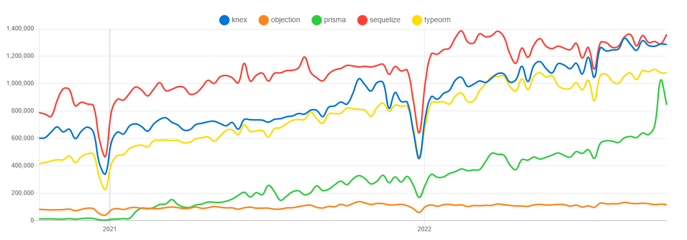

# ORM research for TypeScript Node.js applications

## Table of contents

- [Introduction](#introduction)
  - [Important concepts](#important-concepts)
  - [Which libraries are we going to analize?](#which-libraries-are-we-going-to-analize)
- [Case study](#case-study)
  - [Database schema](#database-schema)
  - [Endpoints](#endpoints)
- [Results](#results)
  - [Community](#community)
  - [Documentation](#documentation)
  - [TypeScript integration](#typescript-integration)
  - [Performance](#performance)
- [Developing](#developing)
  - [Database configuration](#database-configuration)
  - [Migrations](#migrations)
  - [Starting app](#starting-app)
  - [Debugging](#debugging)
- [License](#license)

## Introduction

**Object-Relational Mapping (ORM)** is a technique that consists in encapsulate the code needed to manipulate the data in your database, so you don't use SQL anymore; you interact directly with an interface in the same language you're using.

When people talk about an ORM, they usually make reference to a library that implements this technique. You can find a great explanation in the following link from [StackOverflow](https://stackoverflow.com/questions/1279613/what-is-an-orm-how-does-it-work-and-how-should-i-use-one).

On the other hand, as it name claims, a **query builder** is an interface that allows you to write SQL in your prefered language. Main difference with ORMs is that you don't have to define models structure for a query builder because you are not working with objects that represents your data.

This research objective isn't to claim which is the best ORM out there but to provide an objective vision about these libraries most important features, performance, community, documentation, and more.

## Case study

### Libraries

- [Sequelize](https://sequelize.org/): It features solid transaction support, relations, eager and lazy loading, read replication and more. It is one of the most complete ORMs for Node.js. It has support for Postgres, MySQL, MariaDB, SQLite and Microsoft SQL Server.
- [Knex](http://knexjs.org/): It's a very powerful query builder with transactions support. It hasn't all features an ORM may has but its performance it's quite better. Postgres, MSSQL, MySQL, MariaDB, SQLite3, Oracle, and Amazon Redshift.
- [TypeORM](https://typeorm.io/#/): Its goal is to always support the latest JavaScript features and provide additional features that help you to develop any kind of application that uses databases. It supports MySQL, MariaDB, Postgres, CockroachDB, SQLite, Microsoft SQL Server, Oracle and [MongoDB NoSQL](https://github.com/typeorm/typeorm/blob/master/docs/active-record-data-mapper.md).
- [Objection](https://vincit.github.io/objection.js/): It's build on Knex, thus supports the same databases. It has all the benefits of an SQL query builder but also a powerful set of tools for working with relations, for this it can be considered an ORM.
- [Prisma ORM](https://www.prisma.io/): Prisma unlocks a new level of developer experience when working with databases thanks to its intuitive data model, automated migrations, type-safety & auto-completion.
- [Drizzle ORM](https://orm.drizzle.team/): Drizzle ORM is a headless TypeScript ORM with a head 🐲. It looks and feels simple, performs on day 1000 of your project, lets you do things your way, and is there when you need it..

Other libraries were considered for this research but we discarded them, I’m going to do a special mention for the following:

- [Bookshelf](https://bookshelfjs.org/): Another query builder based on Knex, like Objection. After comparing both, we opted for Objection because we considered that its API implementation is better and a preliminary performance tests showed has the best performance.
- [Waterline](https://waterlinejs.org/): It’s [Sails.js](https://sailsjs.com/) ORM library. Although it seems very interesting, there is a lack of documentation about standalone implementation. Also we couldn’t find any good examples out there about a project implementing it outside Sails environment.

### Database schema

For research purposes, we had to define a database schema. We wanted to keep it simple but also explore models relations API of each library. For that reason we decided to implement a simple ManyToMany relation. We used [Postgres](https://www.postgresql.org/) as database engine.

Above you can see database schema graph and its definition.


```
Table orders {
  id int [pk]
  user string
  date timestamp
}

Table items {
  id int [pk]
  name string
  value float
}

Table order_items {
  order_id int [ref: > orders.id]
  item_id int [ref: > items.id]
}

```

### Implementation

In order to have where implement our study libraries we developed a simple [Express.js](https://expressjs.com/) application with two endpoints. Main idea is to contrast how these libraries behave in most common use cases, check performance, compare implementation complexity, etc.

```
# ⬇️ Get all orders
#
# If query string 'simple' is set to "true", then app will return
# just the records from "orders" table. Otherwise, we are going to
# receive orders array with its nested relations.
GET /<orm_name>/orders?simple=<boolean>

# ⬆️ Create orders
#
# This endpoint receives an array of orders and create them.
# Orders could include nested relations, in that cases app should
# hanlde it and create them too.
POST /<orm_name>/orders # Create many orders with their items
```

The key on this implementation is that we are managing nested resources: an order has one or many items. Payloads we receive has orders and its nested items, and we have to handle them.

After all this setup we are finally ready to implement our libraries and start having some results.

## Results

### Community

First, we can look at NPM packages and their metrics to have a clear image about how much they are being used.

<table width="100%" align="center">
  <tr>
    <th>Library</th>
    <th>Creation date</th> 
    <th>Weekly downloads</th> 
    <th>Dependents</th> 
  </tr>
  <tr align="center">
    <td>
      <a link="https://www.npmjs.com/package/sequelize" target="blank">Sequelize</a>
    </td>
    <td>May 03, 2011</td>
    <td>1,360,710</td>
    <td>5,371</td>
  </tr>
  <tr align="center">
    <td>
      <a link="https://www.npmjs.com/package/knex" target="blank">Knex</a>
    </td>
    <td>May 1, 2013</td>
    <td>1,286,645</td>
    <td>3,374</td>
  </tr>
  <tr align="center">
    <td>
      <a link="https://www.npmjs.com/package/typeorm" target="blank">TypeORM</a>
    </td>
    <td>April 19, 2016</td>
    <td>1,079,037</td>
    <td>3,010</td>
  </tr>
  <tr align="center">
    <td>
      <a link="https://www.npmjs.com/package/objection" target="blank">Objection</a>
    </td>
    <td>August 8, 2015</td>
    <td>117,582</td>
    <td>402</td>
  </tr>
  <tr align="center">
    <td>
      <a link="https://www.npmjs.com/package/prisma" target="blank">Prisma</a>
    </td>
    <td>June 3, 2015</td>
    <td>846,538</td>
    <td>183</td>
  </tr>
  <tr align="center">
    <td>
      <a link="https://www.npmjs.com/package/drizzle-orm" target="blank">Drizzle ORM</a>
    </td>
    <td>September 9, 2021</td>
    <td>92,499</td>
    <td>59</td>
  </tr>
</table>

<p align="left">
  
</p>

With this information, we can take some assumptions. First of all, clearly Sequelize is the most used library. It has been in the game for the longest time and its community haven’t stopped growth.

It’s interesting to see that Knex is almost as used as Sequelize despite being a less friendly solution. Besides both packages duplicated their weekly downloads this year. Objection, on the other hand, shows practically an almost null increase in their weekly downloads, keeping it around 50K downloads per week.

Finally, in the last year TypeORM has triplicated its downloads. Despite staying still well below Sequelize and Knex it seems to be positioning itself as an interesting competitor.

**You can find an updated analisys about npm packages on [NPM Trends](https://www.npmtrends.com/knex-vs-sequelize-vs-objection-vs-typeorm) 🔗**.

### Documentation

Documentation is a really important element when you have to choose a library. On this depends how much easy or painful could be to implement it.
For that reason, we analysed the next points:

- **Implementation**: Provides a "Getting started" guide, with examples and steps explanations about how to implement the library in my project.
- **Recipes**: Provides examples about how to implement solutions for different case uses (ie: relations).
- **Real-world examples**: Provides real-world examples, with implementations in differents frameworks.
- **Straightforward**: Easy to find needed information and read, updated and clear.
- **TypeScript implementation**: Provides documentation about TypeScript support, with examples and explanations about best practices.

<table width="100%" align="center">
  <tr>
    <th>Library</th>
    <th>Implementation</th> 
    <th>Recipes</th> 
    <th>Real-world examples</th>
    <th>Straightforward</th>
    <th>TypeScript</th>
  </tr>
  <tr align="center">
    <td>
      <a link="https://sequelize.org/v5/manual/getting-started.html" target="blank">Sequelize</a>
    </td>
    <td>✅</td>
    <td>✅</td>
    <td>❌</td>
    <td>❌</td>
    <td>⚠️</td>
  </tr>
  <tr align="center">
    <td>
      <a link="http://knexjs.org/" target="blank">Knex</a>
    </td>
    <td>✅</td>
    <td>❌</td>
    <td>❌</td>
    <td>✅</td>
    <td>⚠️</td>
  </tr>
  <tr align="center">
    <td>
      <a link="https://typeorm.io/#/" target="blank">TypeORM</a>
    </td>
    <td>✅</td>
    <td>✅</td>
    <td>✅</td>
    <td>✅</td>
    <td>✅</td>
  </tr>
  <tr align="center">
    <td>
      <a link="https://vincit.github.io/objection.js/guide/" target="blank">Objection</a>
    </td>
    <td>✅</td>
    <td>✅</td>
    <td>✅</td>
    <td>✅</td>
    <td>✅</td>
  </tr>
  <tr align="center">
    <td>
      <a link="https://www.prisma.io/docs/getting-started" target="blank">Prisma</a>
    </td>
    <td>✅</td>
    <td>✅</td>
    <td>✅</td>
    <td>✅</td>
    <td>✅</td>
  </tr>
  <tr align="center">
    <td>
      <a link="https://orm.drizzle.team/docs/overview" target="blank">Drizzle</a>
    </td>
    <td>✅</td>
    <td>✅</td>
    <td>✅</td>
    <td>✅</td>
    <td>✅</td>
  </tr>
</table>

Given all these libraries are used for thousands of people around the globe everyday is not strange that they document the basics on how to implement and start using they. But, for an advanced use, we need more information.

Based in our research TypeORM and Objection are the best-documented ORMs. Both has an easy to understand, straightforward and user-friendly documentation, they provide real-world examples and recipes for the most common use cases. Besides, they both provide information about TypeScript support, with examples and best practices.

Either Sequelize and Knex provide TypeScript documentation, it is not enough to implement a clean solution in our projects and requires more research.

Knex documentation is not bad, but it lacks in official recipes or real-world examples.

Although Sequelize has a very large documentation, it is difficult to find something in there specially for edge cases.

### TypeScript integration

In the section above, we talk about TypeScript documentation these libraries provide

All analized libraries expose their own types we can use, but not all has a great integration with TypeScript and developing experience could be a little bit rough with some of them.

#### Sequelize 👎

Quoting its [own documentation](https://sequelize.org/master/manual/typescript.html): _"As Sequelize heavily relies on runtime property assignments, TypeScript won't be very useful out of the box. A decent amount of manual type declarations are needed to make models workable."_. Working with Sequelize and TypeScript could be a really bad experience when you are starting with typing in JavaScript. You have to do a lot of manual work to define your models types and made them work in strict mode.

Relationships are hard with Sequelize and TypeScript. You’ll need to add a set of mixin functions for every single [association](https://sequelize.org/master/manual/associations.html) you create and on both the models involved in the association. If you want to know more about this, you can read [this article which explains how to setup Sequelize with TypeScript](https://vivacitylabs.com/setup-typescript-sequelize/).

Moreover, when you start deep inside sequelize functionality you will notice many optional properties you can pass some functions are not typed! For example, when you use `bulkCreate` optional property `include` (which should be defined on `BulkCreateOptions` interface) is not created so you have to extend Sequelize type definitions yourself in order to use it.

#### Knex 👍

Remember Knex is just a query builder, so we don't define objects that represents our database tables. For this reason, we need to create interfaces for our inputs and outputs. Besides that, **integration between TypeScript and Knex is acceptable**.

#### TypeORM 🏆

TypeORM, name already gives us a hint. **It is a perfect partner for TypeScript** and is the one that exploits the most its capabilities. It allows you to write only one TypeScript Class and automatically generates all structure for your entity.

Code complexity and quantity are greatly reduced, thus our entities definitions are much more cleaner than, for example, Sequelize.

Decorators can seem strange at first sight, especially if you've never implement this concept before, but once you get used to them they are very easy to use.

#### Objection 🏆

**Integration with TypeScript is surprisingly simple and intuitive**. You define your models and Objection automatically generates all structure you need to use them. Models definition are very clean and use them is very straightforward.

Documentation is very simple and useful and you have [real-world examples as guide](https://github.com/Vincit/objection.js/blob/master/examples/express-ts/).

Besides, it could be a good alternative if you want to avoid using TypeORM decorators syntax, and keep a more conservative sintax.

### Performance

Probably one of the most controversial topics around ORMs is their performance, thus before start let me do a little disclaimer. This research doesn’t intent to convince you, or not, to use an ORM in your project, there are already a bunch of publications that talk about that. We are going to focus on just in a comparison between our selected libraries uses the use cases we presented before. That said, let's start.

To perform load tests against our application we used [autocannon](https://github.com/mcollina/autocannon). It is a fast HTTP/1.1 benchmarking tool written in Node.js. All tests were benchmarked using these options:

```bash
# Load script for GET (simple)
autocannon "localhost:8080/<orm>/orders?simple=true" \
  -m "GET" \
  -c 100 -d 20

# Load script for GET (nested)
autocannon "localhost:8080/<orm>/orders" \
  -m "GET" \
  -c 100 -d 20

# Load script for POST
autocannon "localhost:8080/<orm>/orders" \
  -m "POST" \
  -c 100 -d 20 \
  -i "./data.json" \
  -H "Content-Type: application/json"

# where <orm> = knex|typeorm|sequelize|objection|prisma
```

- `-c` The number of concurrent connections to use.
- `-d` The number of pipelined requests to use.
- `-m` The method of the requests.
- `-i` File path for request body.
- `-H` Headers definitions.

Test Bench Configuration:

- **OS**: Windows 11 Pro - 21H2 (OS Build 22000.1098)
- **CPU**: AMD Ryzen 7 5700G , 3801 Mhz, 8 Core(s), 16 Logical Processor(s)
- **RAM**: 32 GB 3400 MHz DDR4.
- **Node version**: v18.15.0.

---

## Benchmark 2022-10-10

#### GET simple (15000 orders)

<table>
  <tr>
    <th>Library</th>
    <th>Latency avg</th>
    <th>Latency max</th>
    <th>Req/Sec avg</th>
    <th>Req/Sec min</th>
    <th>Bytes/Sec avg</th>
    <th>Bytes/Sec min</th>
  </tr>
  <tr align="center">
    <td><a>Sequelize 6.35.1</a></td>
    <td>5729.64 ms</td>
    <td>6955 ms</td>
    <td>14.65</td>
    <td>13</td>
    <td>17.2 MB</td>
    <td>15.3 MB</td>
  </tr>
  <tr><td colspan="7">393 requests in 20.22s, 345 MB read</td></tr>
  <tr align="center">
    <td><a>Knex 3.0.1</a></td>
    <td>2548.76 ms</td>
    <td>2889 ms</td>
    <td>36.85</td>
    <td>31</td>
    <td>43.4 MB</td>
    <td>36.5 MB</td>
  </tr>
  <tr><td colspan="7">837 requests in 20.15s, 867 MB read</td></tr>
  <tr align="center">
    <td><a>TypeORM 0.3.17</a></td>
    <td>4032.2 ms</td>
    <td>4770 ms</td>
    <td>22.3</td>
    <td>19</td>
    <td>26.2 MB</td>
    <td>22.4 MB</td>
  </tr>
  <tr><td colspan="7">546 requests in 20.22s, 525 MB read</td></tr>
  <tr align="center">
    <td><a>Objection 3.1.3</a></td>
    <td>2771.38 ms</td>
    <td>3164 ms</td>
    <td>33.75</td>
    <td>28</td>
    <td>39.7 MB</td>
    <td>32.9 MB</td>
  </tr>
  <tr><td colspan="7">775 requests in 20.19s, 794 MB read</td></tr>
  <tr align="center">
    <td><a>Prisma 5.6.0</a></td>
    <td>4682.49 ms</td>
    <td>7081 ms</td>
    <td>18.9</td>
    <td>6</td>
    <td>21.7 MB</td>
    <td>6.87 MB</td>
  </tr>
  <tr><td colspan="7">478 requests in 20.21s, 433 MB read</td></tr>
</table>

#### GET nested object (15000 orders)

<table>
  <tr>
    <th>Library</th>
    <th>Latency avg</th>
    <th>Latency max</th>
    <th>Req/Sec avg</th>
    <th>Req/Sec min</th>
    <th>Bytes/Sec avg</th>
    <th>Bytes/Sec min</th>
  </tr>
  <tr align="center">
    <td><a>Sequelize</a></td>
    <td>5556.5 ms</td>
    <td>9923 ms</td>
    <td>0.7</td>
    <td>1</td>
    <td>3.85 MB</td>
    <td>5.49 MB</td>
  </tr>
  <tr><td colspan="7">300 requests in 20.23s, 76.9 MB read - 186 errors (186 timeouts)</td></tr>
  <tr align="center">
    <td><a>Knex</a></td>
    <td>2548.86 ms</td>
    <td>2889 ms</td>
    <td>36.85</td>
    <td>31</td>
    <td>9.9 MB</td>
    <td>3.96 MB</td>
  </tr>
  <tr><td colspan="7">300 requests in 20.19s, 198 MB read - 150 errors (150 timeouts)</td></tr>
  <tr align="center">
    <td><a>TypeORM</a></td>
    <td>5338 ms</td>
    <td>9825 ms</td>
    <td>1.35</td>
    <td>1</td>
    <td>5.35 MB</td>
    <td>3.96 MB</td>
  </tr>
  <tr><td colspan="7">300 requests in 20.22s, 107 MB read - 173 errors (173 timeouts)</td></tr>
  <tr align="center">
    <td><a>Objection</a></td>
    <td>5372.15 ms</td>
    <td>9980 ms</td>
    <td>1.7</td>
    <td>2</td>
    <td>6.73 MB</td>
    <td>7.92 MB</td>
  </tr>
  <tr><td colspan="7">300 requests in 20.21s, 135 MB read - 166 errors (166 timeouts)</td></tr>
  <tr align="center">
    <td><a>Prisma</a></td>
    <td>54.27 ms</td>
    <td>135 ms</td>
    <td>1824.4</td>
    <td>1164</td>
    <td>792 kB</td>
    <td>505 kB</td>
  </tr>
  <tr><td colspan="7">37k requests in 20.04s, 15.8 MB read</td></tr>
</table>

#### POST nested object

<table>
  <tr>
    <th>Library</th>
    <th>Latency avg</th>
    <th>Latency max</th>
    <th>Req/Sec avg</th>
    <th>Req/Sec min</th>
    <th>Bytes/Sec avg</th>
    <th>Bytes/Sec min</th>
  </tr>
  <tr align="center">
    <td><a>Sequelize</a></td>
    <td>175.38 ms</td>
    <td>403 ms</td>
    <td>566.85</td>
    <td>365</td>
    <td>212 kB</td>
    <td>136 kB</td>
  </tr>
  <tr><td colspan="7">11k requests in 20.06s, 4.24 MB read - 11437 orders</td></tr>
  <tr align="center">
    <td><a>Knex</a></td>
    <td>166.73 ms</td>
    <td>585 ms</td>
    <td>596.1</td>
    <td>298</td>
    <td>226 kB</td>
    <td>112 kB</td>
  </tr>
  <tr><td colspan="7">12k requests in 20.05s, 4.52 MB read - 12022 orders</td></tr>
  <tr align="center">
    <td><a>TypeORM</a></td>
    <td>218.02 ms</td>
    <td>812 ms</td>
    <td>456.15</td>
    <td>143</td>
    <td>155 kB</td>
    <td>48.1 kB</td>
  </tr>
  <tr><td colspan="7">9k requests in 20.06s, 3.1 MB read - 9223 orders</td></tr>
  <tr align="center">
    <td><a>Objection</a></td>
    <td>240.74 ms</td>
    <td>585 ms</td>
    <td>412.95</td>
    <td>206</td>
    <td>140 kB</td>
    <td>69.4 kB</td>
  </tr>
  <tr><td colspan="7">8k requests in 20.06s, 2.81 MB read - 8359 orders</td></tr>
  <tr align="center">
    <td><a>Prisma</a></td>
    <td>76.29 ms</td>
    <td>107 ms</td>
    <td>1300.6</td>
    <td>1115</td>
    <td>408 kB</td>
    <td>350 kB</td>
  </tr>
  <tr><td colspan="7">26k requests in 20.04s, 8.17 MB read - 26112 orders</td></tr>
  <tr align="center">
    <td><a>Drizzle</a></td>
    <td>1516.16 ms</td>
    <td>1643 ms</td>
    <td>65</td>
    <td>31</td>
    <td>17.4 kB</td>
    <td>8.31 kB</td>
  </tr>
  <tr><td colspan="7">1k requests in 20.19s, 348 kB read - 1400 orders</td></tr>
</table>

---

## Developing

### Database configuration

Before running the app, make sure you have [Postgresql installed](https://www.digitalocean.com/community/tutorials/how-to-install-and-use-postgresql-on-ubuntu-14-04) installed.

You need to create project database manually, to create it run the following steps inside a psql terminal:

1. `CREATE DATABASE db_project_name;`
2. `\c db_project_name`
3. `CREATE ROLE "project_name" LOGIN CREATEDB PASSWORD 'project_name';`

Don't forget to create a dotenv file for environment variables. `Dotenv` is used for managing environment variables. They must be stored in a `/.env` file. File structure is described below:

```
DB_HOST=localhost
DB_PORT=5432
DB_USERNAME=project_name
DB_PASSWORD=project_name
DB_NAME=db_project_name
```

### Migrations

You need to run migrations before start app. To do it simply run `npm run migrate`.

### Starting app

Run in your terminal: `npm start`.

### Debugging

In order to debug our Node.js application, we enable 'sourceMap' in `tsconfig.json`, this compiler option generates corresponding `.map` files from original Javascipt counterpart. This change is mandatory to attach a debugger, otherwise it wouldn't be able to match transpiled files with their originals.

In VSCode, you will need to add an `./.vscode/launch.json` file in order to launch the debugger. You can use the following:

```json
{
  // Use IntelliSense to learn about possible attributes.
  // Hover to view descriptions of existing attributes.
  // For more information, visit: https://go.microsoft.com/fwlink/?linkid=830387
  "version": "0.2.0",
  "configurations": [
    {
      "type": "node",
      "request": "launch",
      "name": "Launch Program",
      "program": "${workspaceFolder}/server.ts",
      "preLaunchTask": "tsc: build - tsconfig.json",
      "internalConsoleOptions": "neverOpen",
      "console": "integratedTerminal",
      "disableOptimisticBPs": true,
      "outFiles": ["${workspaceFolder}/dist/**/*.js"]
    }
  ]
}
```

## License

This project is written and maintained by [Emanuel Casco](https://github.com/emanuelcasco) and is available under the MIT [license](LICENSE.md).

    Copyright (c) 2019 Emanuel Casco

    Permission is hereby granted, free of charge, to any person obtaining a copy
    of this software and associated documentation files (the "Software"), to deal
    in the Software without restriction, including without limitation the rights
    to use, copy, modify, merge, publish, distribute, sublicense, and/or sell
    copies of the Software, and to permit persons to whom the Software is
    furnished to do so, subject to the following conditions:

    The above copyright notice and this permission notice shall be included in
    all copies or substantial portions of the Software.

    THE SOFTWARE IS PROVIDED "AS IS", WITHOUT WARRANTY OF ANY KIND, EXPRESS OR
    IMPLIED, INCLUDING BUT NOT LIMITED TO THE WARRANTIES OF MERCHANTABILITY,
    FITNESS FOR A PARTICULAR PURPOSE AND NONINFRINGEMENT. IN NO EVENT SHALL THE
    AUTHORS OR COPYRIGHT HOLDERS BE LIABLE FOR ANY CLAIM, DAMAGES OR OTHER
    LIABILITY, WHETHER IN AN ACTION OF CONTRACT, TORT OR OTHERWISE, ARISING FROM,
    OUT OF OR IN CONNECTION WITH THE SOFTWARE OR THE USE OR OTHER DEALINGS IN
    THE SOFTWARE.
